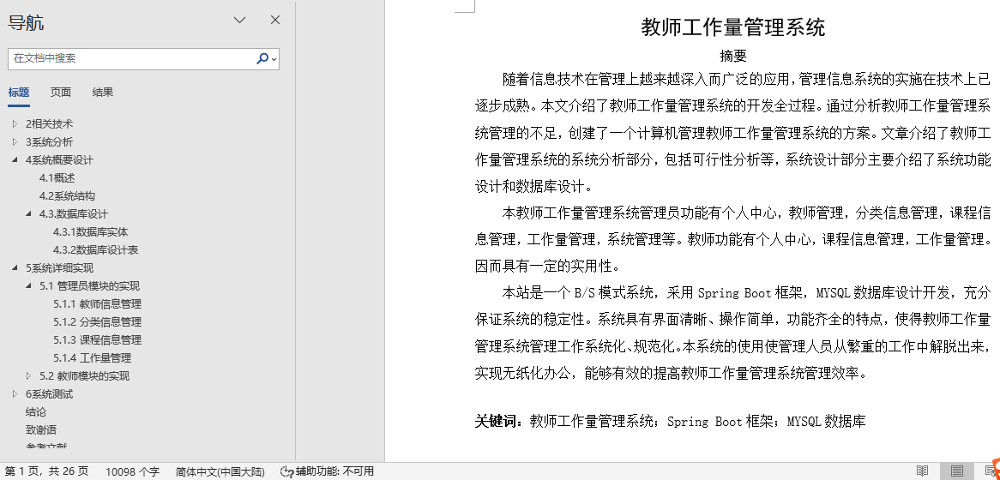
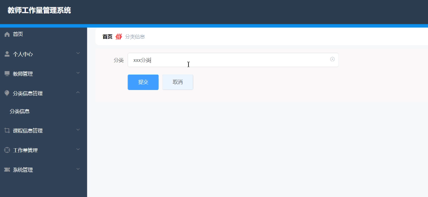
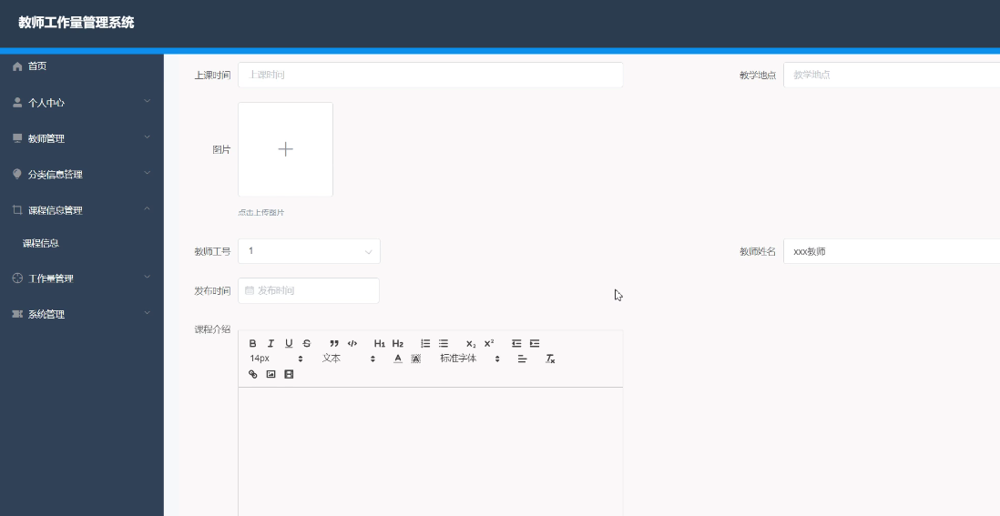
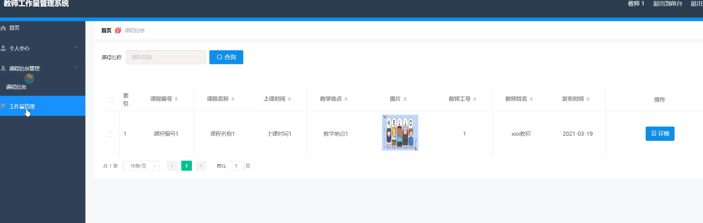
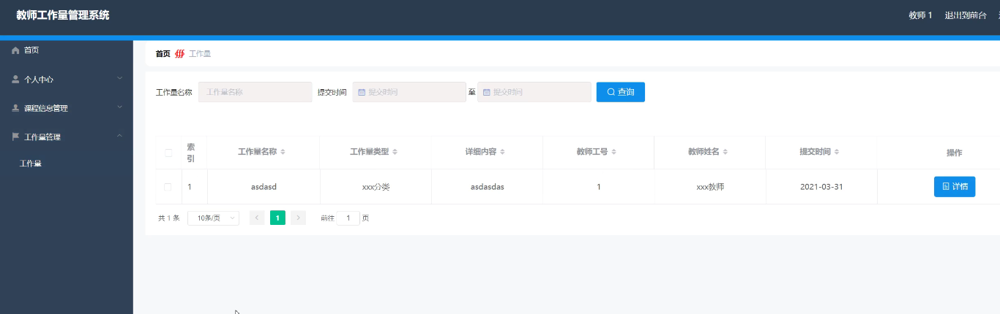
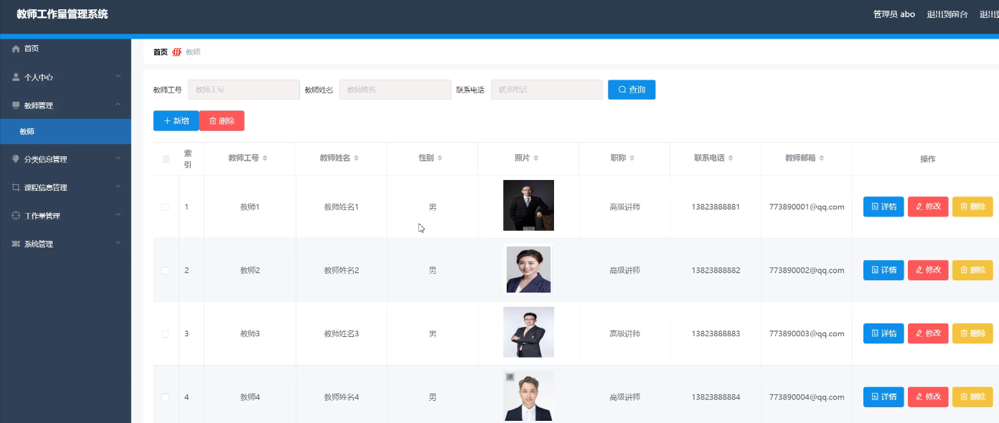

## 教师工作量管理系统(程序+报告)

###  获取sql数据库文件: 从戎源码网 (https://armycodes.com/) QQ: 386869957 QQ群: 377586148
###  所有系统地址: (https://github.com/YuLin-Coder/AllProjectCatalog) 
###  所有项目以及源代码本人均调试运行无问题 可支持远程安装部署调试、定制修改、代码讲解

## 项目介绍
教师工作量管理系统，系统包含两种角色：用户、管理员，系统分为前台和后台两大模块，主要功能如下：

管理员模块的实现

- 教师信息管理  
  系统管理员可以管理教师信息，包括对教师信息的修改、删除以及查询操作。

- 分类信息管理  
  系统管理员可以对分类信息进行添加、修改、删除以及查询操作。

- 课程信息管理  
  系统管理员可以对课程信息进行添加、修改、删除以及查询操作。

- 工作量管理  
  系统管理员可以对教师的工作量进行添加、修改、删除操作。

教师模块的实现

- 课程信息  
  教师可以查看前台展示的课程信息。

- 课程信息管理  
  教师可以查看并管理自己的课程信息。

- 工作量  
  教师可以查看自己的工作量信息。

## 项目技术
- 编程语言：Java
- 数据库：MySQL
- 项目管理工具：Maven
- 前端技术：HTML、CSS、JavaScript、Jquery、Vue
- 后端技术：Spring、SpringMVC、MyBatis

## 运行环境
- JDK版本：JDK1.8及以上
- 开发工具：IDEA、Ecplise、Myecplise都可以
- 数据库: MySQL5.7及以上
- Maven：maven3.0及以上
- Node：14.14.0及以上

## 运行截图

